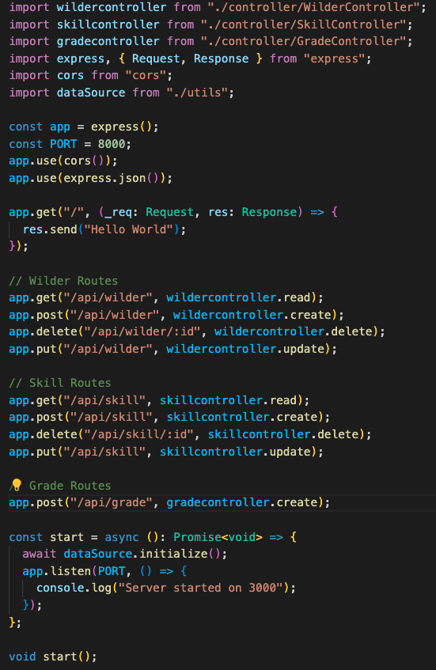

# REST API

> ❌ A travailler

> ✔️ Auto validation par l'étudiant

## 🎓 J'ai compris et je peux expliquer

- les verbes HTTP ✔️ CREATE (post) | READ (get) | UPDATE (put) | DELETE (delete) sont les verbes https qui indiquent l'action que l'on souhaite réaliser sur notre base de donnée

- les statuts HTTP ✔️ Réponse qui indique l'état de notre requête http (200, 201, 400, 404, 418 🫖)

- les endpoints ✔️ URL qui donne l'emplacement d'une ressource
- CORS ✔️ « Cross-origin resource sharing » | Autorisation pour le naviguateur pour d'effectuer des requêtes http
- la nomenclature recommandée pour les routes ❌ / ✔️

## 💻 J'utilise

### Un exemple personnel commenté ✔️

### Utilisation dans un projet ✔️

[Boilerplate node-express-ts (branche wilder-server)](https://github.com/ThomasDCW/boilerplate-node-typescript/tree/wilder-server)

Description :

- CRUD node-express-typscript
- API REST de wilders (élèves de la wild code school), chaque wilder peut se voir attribuer des compétences, ses compétences peuvent être notées.
- DB : SQLITE

<!-- ### Utilisation en production si applicable ❌

[lien du projet](...)

Description : -->

<!-- ### Utilisation en environement professionnel ❌ / ✔️

Description :

## 🌐 J'utilise des ressources

### Titre

- lien
- description

## 🚧 Je franchis les obstacles

### Point de blocage ❌ / ✔️

Description:

Plan d'action : (à valider par le formateur)

- action 1 ❌ / ✔️
- action 2 ❌ / ✔️
- ...

Résolution :

## 📽️ J'en fais la démonstration

- J'ai ecrit un [tutoriel](...) ❌ / ✔️
- J'ai fait une [présentation](...) ❌ / ✔️ -->
